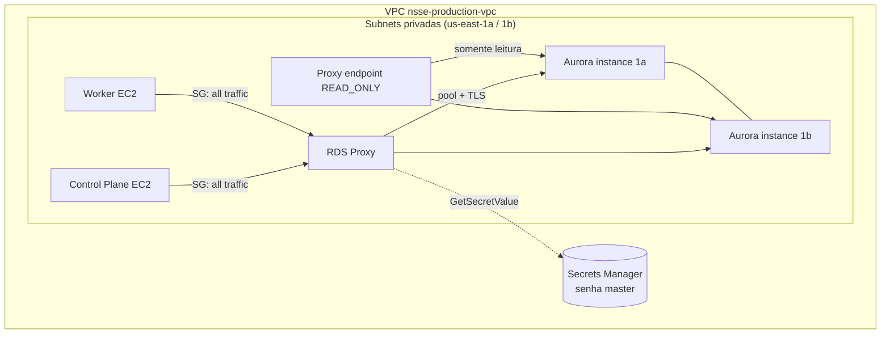
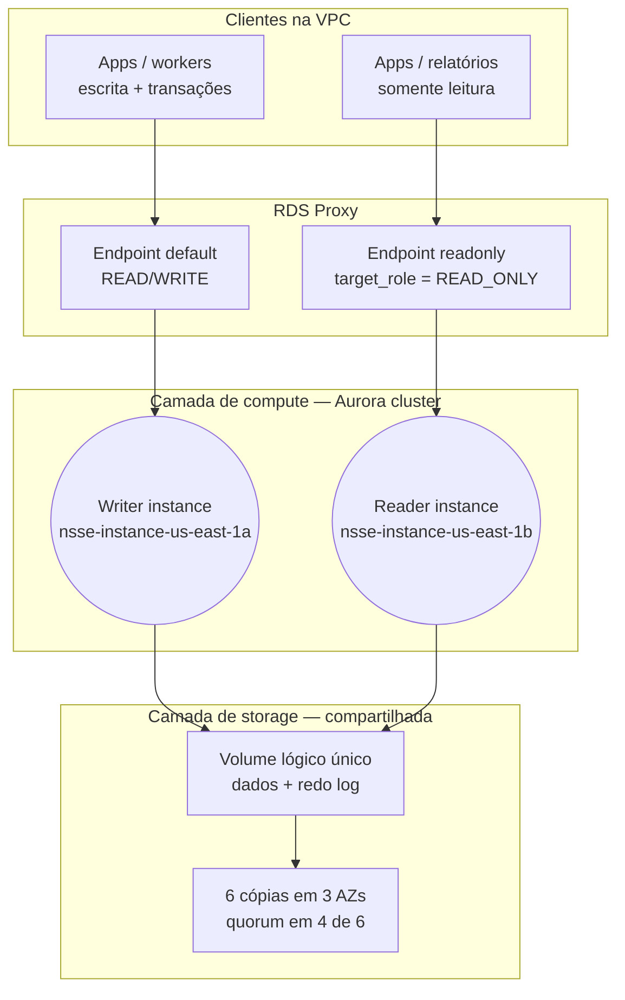
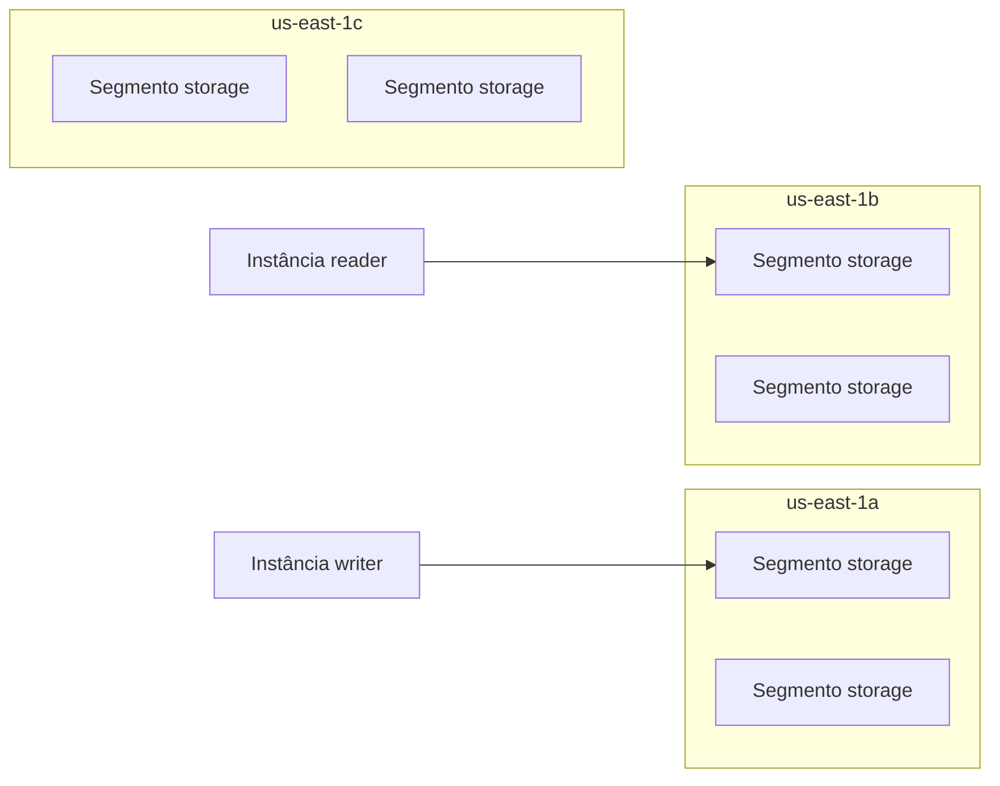
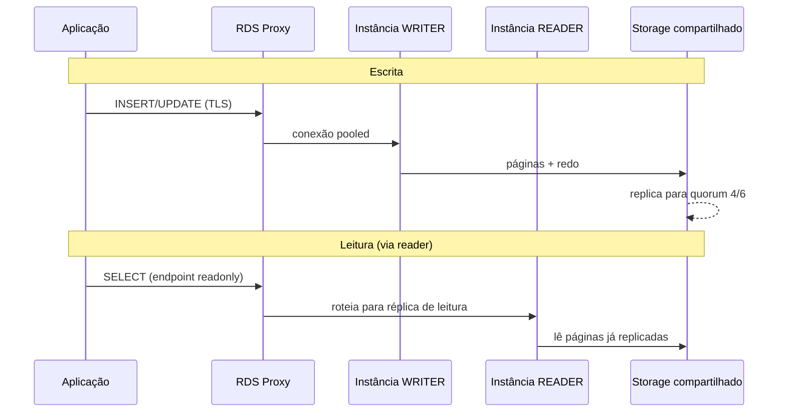
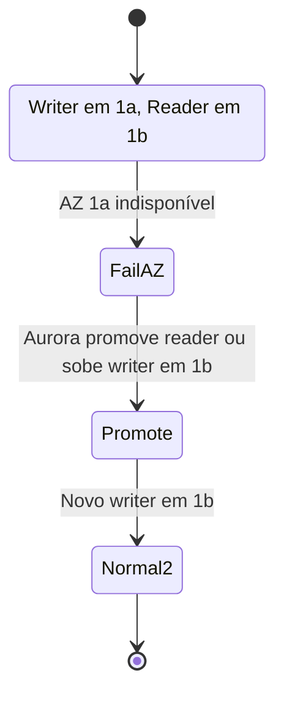
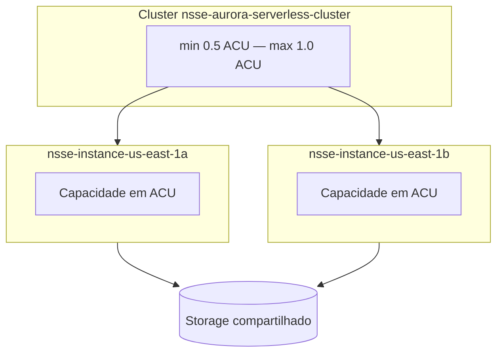
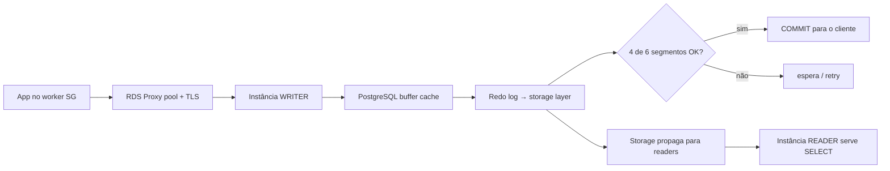

# Módulo Serverless — Aurora PostgreSQL e RDS Proxy

> Análise detalhada de todos os recursos RDS/Aurora na pasta `serverless/`, suas relações, decisões de implementação e topologia de storage/replicação.

---

## Sumário

1. [Visão geral da arquitetura](#1-visão-geral-da-arquitetura)
2. [Mapa de dependências](#2-mapa-de-dependências)
3. [Fundação do módulo](#3-fundação-do-módulo)
4. [Camada de rede (data sources)](#4-camada-de-rede-data-sources)
5. [DB Subnet Group](#5-db-subnet-group)
6. [Cluster Aurora Serverless v2](#6-cluster-aurora-serverless-v2)
7. [Instâncias do cluster](#7-instâncias-do-cluster)
8. [Security Groups](#8-security-groups)
9. [RDS Proxy](#9-rds-proxy)
10. [IAM do RDS Proxy](#10-iam-do-rds-proxy)
11. [Endpoint somente leitura do Proxy](#11-endpoint-somente-leitura-do-proxy)
12. [Outputs e lacunas](#12-outputs-e-lacunas)
13. [Integração com outros módulos](#13-integração-com-outros-módulos)
14. [Decisões de design — resumo](#14-decisões-de-design--resumo)
15. [Topologia de storage e replicação](#15-topologia-de-storage-e-replicação)
16. [Failover e endpoints](#16-failover-e-endpoints)
17. [ACUs e custo](#17-acus-e-custo)
18. [Fluxo de transações](#18-fluxo-de-transações)
19. [Recomendações práticas](#19-recomendações-práticas)
20. [Evoluções futuras](#20-evoluções-futuras)
21. [Referências](#21-referências)

---

## 1. Visão geral da arquitetura

O módulo `serverless/` provisiona um **Aurora PostgreSQL Serverless v2** em rede privada, com **RDS Proxy**, security groups dedicados e integração com a VPC criada no módulo `networking/`.



**Fluxo esperado em produção:** aplicações nos nós EC2 (control plane / workers) conectam ao **endpoint do RDS Proxy**, não diretamente ao cluster — o proxy multiplexa conexões e usa a senha do Secrets Manager.

**RDS Proxy** = gerenciamento e pool de conexões com o banco de dados (ver também `readme.md` na raiz do repositório).

---

## 2. Mapa de dependências

```
data.aws_vpc.this
    └──► data.aws_subnets.private_subnets
    └──► aws_security_group.postgresql

data.aws_security_group.control_plane  ──┐
data.aws_security_group.worker         ──┼──► aws_security_group_rule (ingress)

aws_db_subnet_group.this
    └──► aws_rds_cluster.this
              └──► aws_rds_cluster_instance.this (×2)
              └──► master_user_secret (Secrets Manager, gerenciado pela AWS)

aws_iam_role.rds_proxy_role
    └──► aws_iam_policy.rds_proxy_policy
              └──► aws_iam_role_policy_attachment

aws_rds_cluster.this + aws_iam_role + aws_security_group + subnets
    └──► aws_rds_proxy.this
              └──► aws_db_proxy_default_target_group.main
                        └──► aws_db_proxy_target.this
              └──► aws_db_proxy_endpoint.readonly
```

**Ordem de apply típica:** `networking/` → `server/` → `serverless/` (por dependência de VPC, subnets e security groups dos EC2).

---

## 3. Fundação do módulo

**Arquivo:** `serverless/main.tf`

| Aspecto | Implementação |
|---------|---------------|
| Provider | AWS `~> 5.92`, região `us-east-1` |
| Backend | S3 `nsse-terraform-state-files-2026`, key `serverless/terraform.tfstate` |
| Lock | DynamoDB `nsse-terraform-state-locking` |
| Assume role | `arn:aws:iam::705777573148:role/terraform-role` |

Isso isola o state do Aurora dos módulos `networking/` e `server/`, mantendo todos na mesma conta/região.

---

## 4. Camada de rede (data sources)

### VPC

**Arquivo:** `serverless/data.vpc.tf`

- Busca a VPC pelo tag `Name = nsse-production-vpc` (variável `vpc_resources.vpc`).
- Não cria VPC; reutiliza infraestrutura do módulo `networking/`.

### Subnets privadas

**Arquivo:** `serverless/data.vpc.private-subnets.tf`

- Filtra subnets da VPC com `map-public-ip-on-launch = false`.
- Usadas pelo DB subnet group, RDS Proxy e ENIs do cluster.

### Security groups existentes

**Arquivo:** `serverless/data.security-groups.tf`

- Referencia SGs do **control plane** e **workers** criados no módulo `server/`.
- Usados nas regras de ingress do SG do RDS.

**Motivo:** o Aurora fica **somente em subnets privadas**, sem IP público — alinhado ao plano de acesso via túnel/bastion documentado no `readme.md`.

---

## 5. DB Subnet Group

**Arquivo:** `serverless/rds.cluster.db-subnet-group.tf`

```hcl
resource "aws_db_subnet_group" "this" {
  name       = var.db_subnet_group   # nsse-production-db-subnet-group
  subnet_ids = data.aws_subnets.private_subnets.ids
  tags       = var.tags
}
```

| Aspecto | Detalhe |
|---------|---------|
| Nome | `nsse-production-db-subnet-group` |
| Subnets | Todas as subnets privadas detectadas na VPC |

**Motivo (AWS):** RDS/Aurora exige subnets em **pelo menos duas AZs** para alta disponibilidade. O subnet group informa em quais subnets o cluster e o proxy obtêm interfaces de rede (ENIs).

---

## 6. Cluster Aurora Serverless v2

**Arquivo:** `serverless/rds.cluster.tf`  
**Variáveis:** `serverless/variables.tf` → `rds_aurora_cluster`

### Escolha: Aurora PostgreSQL Serverless v2

| Parâmetro | Valor | Significado |
|-----------|--------|-------------|
| `cluster_identifier` | `nsse-aurora-serverless-cluster` | Identificador do cluster |
| `engine` | `aurora-postgresql` | Motor compatível com PostgreSQL; storage compartilhado no cluster |
| `engine_mode` | `provisioned` | Modo correto para **Serverless v2** (v1 usava `engine_mode = serverless`) |
| `database_name` | `notSoSimpleEcommerce` | Database inicial |
| `master_username` | `nsseAdmin` | Usuário master |
| Instâncias | `db.serverless` em `1a` e `1b` | Capacidade em ACUs, não em classe fixa tipo `db.r6g.large` |
| `serverless_scaling_configuration` | min **0.5**, max **1.0** ACU | Escala automática entre meio e um ACU |

**Por que Serverless v2:** carga variável de e-commerce com piso de custo baixo (0.5 ACU) e teto controlado (1.0 ACU). Atenção ao custo combinado Proxy + ACU mínimo por instância (ver [seção 17](#17-acus-e-custo)).

### Segurança e operação

| Parâmetro | Valor | Motivo |
|-----------|--------|--------|
| `manage_master_user_password` | `true` | AWS gera e armazena senha no **Secrets Manager** (`master_user_secret`) — usada pelo RDS Proxy |
| `storage_encrypted` | `true` | Dados em repouso criptografados |
| `deletion_protection` | `true` | Evita destroy acidental em produção |
| `final_snapshot_identifier` | `nsse-aurora-serverless-cluster-final-snapshot` | Snapshot final ao deletar o cluster |
| `preferred_maintenance_window` | `sun:05:00-sun:06:00` | Janela de manutenção (UTC) |
| `availability_zones` | `us-east-1a`, `us-east-1b` | AZs das instâncias de compute |
| `vpc_security_group_ids` | `[aws_security_group.postgresql.id]` | Tráfego controlado por SG |

### Bloco Serverless v2

```hcl
serverlessv2_scaling_configuration {
  max_capacity = var.rds_aurora_cluster.serverless_scaling_configuration.max_capacity
  min_capacity = var.rds_aurora_cluster.serverless_scaling_configuration.min_capacity
}
```

### Não definido explicitamente (defaults AWS)

- `backup_retention_period`
- Janela de backup (`preferred_backup_window`)
- Parameter group customizado
- Logs exportados para CloudWatch
- Performance Insights

Vale revisar para produção.

### Lifecycle comentado

```hcl
# lifecycle {
#   ignore_changes = [availability_zones]
# }
```

Útil se a AWS alterar AZs disponíveis e o Terraform gerar diff indesejado; hoje está desligado.

---

## 7. Instâncias do cluster

**Arquivo:** `serverless/rds.cluster.instances.tf`

| Instância | AZ | Classe |
|-----------|-----|--------|
| `nsse-instance-us-east-1a` | `us-east-1a` | `db.serverless` |
| `nsse-instance-us-east-1b` | `us-east-1b` | `db.serverless` |

```hcl
resource "aws_rds_cluster_instance" "this" {
  count = length(var.rds_aurora_cluster.instances)

  cluster_identifier = aws_rds_cluster.this.id
  instance_class     = var.rds_aurora_cluster.instances[count.index].instance_class
  identifier         = var.rds_aurora_cluster.instances[count.index].identifier
  availability_zone  = var.rds_aurora_cluster.instances[count.index].availability_zone
  engine             = aws_rds_cluster.this.engine
  engine_version     = aws_rds_cluster.this.engine_version
  tags               = var.tags
}
```

**Motivo de duas instâncias:** HA — se uma AZ cair, a outra continua servindo. O **storage Aurora** é replicado na camada distribuída da AWS; as instâncias são nós de **compute** que montam o mesmo volume lógico do cluster.

`engine_version` é herdado do cluster (Terraform não fixa versão — AWS usa default compatível no apply).

---

## 8. Security Groups

**Arquivo:** `serverless/rds.security-group.tf`

SG dedicado: `nsse-production-rds-security-group` (`var.security_groups.rds`).

| Regra | Origem | Tráfego |
|-------|--------|---------|
| `sefl` (typo no nome do recurso) | **self** | todo (`protocol = -1`, todas as portas) |
| `control_plane` | SG do control plane | todo |
| `worker` | SG dos workers | todo |
| Egress | `0.0.0.0/0` | todo |

### Por que `self = true`?

O **RDS Proxy** e as **instâncias Aurora** usam o **mesmo security group**:

```hcl
vpc_security_group_ids = [aws_security_group.postgresql.id]
```

(tanto no cluster quanto no proxy)

O proxy precisa falar com o cluster na porta PostgreSQL (5432) dentro da VPC. A regra *self* permite tráfego entre recursos que compartilham esse SG (proxy ↔ instâncias).

### Observação de hardening

As regras de ingress estão **muito amplas** (`protocol = -1`, todas as portas). Em produção, o ideal é restringir a **TCP 5432** (ou separar SGs para proxy e instâncias).

---

## 9. RDS Proxy

**Arquivos:** `serverless/rds.proxy.tf`, `serverless/rds.proxy.target.tf`

### Proxy principal

| Parâmetro | Valor | Motivo |
|-----------|--------|--------|
| `name` | `nsse-aurora-serverless-cluster-proxy` | Identificador |
| `require_tls` | `true` | Clientes devem usar SSL |
| `idle_client_timeout` | `300` | Fecha conexões ociosas do cliente após 5 min |
| `debug_logging` | `false` | Sem logs verbosos de debug |
| `engine_family` | `POSTGRESQL` | Compatível com Aurora PostgreSQL |
| `auth_scheme` | `SECRETS` | Credenciais do Secrets Manager |
| `iam_auth` | `DISABLED` | Autenticação por usuário/senha do secret, não IAM DB auth |
| `secret_arn` | `master_user_secret[0].secret_arn` | Secret gerenciado pelo Aurora |
| Subnets / SG | Mesmas subnets privadas e mesmo SG do cluster | Co-localização na VPC privada |

**Motivo:** reduz explosão de conexões (comum em muitos pods/processos), reutiliza conexões ao backend e facilita failover sem derrubar todos os clientes de uma vez.

### Target group e pool

```hcl
resource "aws_db_proxy_default_target_group" "main" {
  db_proxy_name = aws_rds_proxy.this.name

  connection_pool_config {
    connection_borrow_timeout    = 120
    max_connections_percent      = 100
    max_idle_connections_percent = 50
  }
}

resource "aws_db_proxy_target" "this" {
  db_cluster_identifier = aws_rds_cluster.this.cluster_identifier
  db_proxy_name         = aws_rds_proxy.this.name
  target_group_name     = aws_db_proxy_default_target_group.main.name
}
```

| Parâmetro do pool | Valor | Significado |
|-------------------|--------|-------------|
| `connection_borrow_timeout` | 120 s | Tempo máximo esperando conexão livre no pool |
| `max_connections_percent` | 100% | Proxy pode usar até 100% do limite de conexões do Aurora |
| `max_idle_connections_percent` | 50% | Até metade das conexões do pool podem ficar ociosas mantidas |

`aws_db_proxy_target` associa o proxy ao **cluster identifier** `nsse-aurora-serverless-cluster` (não a uma instância fixa).

---

## 10. IAM do RDS Proxy

**Arquivo:** `serverless/rds.proxy.permissions.tf`

| Recurso | Nome | Função |
|---------|------|--------|
| `aws_iam_role` | `nsse-production-rds-proxy-role` | Trust policy para `rds.amazonaws.com` |
| `aws_iam_policy` | `nsse-production-rds-proxy-policy` | `secretsmanager:GetSecretValue` no ARN do `master_user_secret[0]` |
| `aws_iam_role_policy_attachment` | — | Anexa policy à role |

Mínimo necessário para o proxy ler a senha gerenciada pelo Aurora.

---

## 11. Endpoint somente leitura do Proxy

**Arquivo:** `serverless/rds.proxy.readonly-endpoint.tf`

```hcl
resource "aws_db_proxy_endpoint" "readonly" {
  db_proxy_name          = aws_rds_proxy.this.name
  db_proxy_endpoint_name = var.rds_proxy.read_only_endpoint  # nsse-aurora-serverless-cluster-proxy-readonly
  target_role            = "READ_ONLY"
  vpc_subnet_ids         = data.aws_subnets.private_subnets.ids
  vpc_security_group_ids = [aws_security_group.postgresql.id]
}
```

**Motivo:** separar tráfego de **SELECT** (relatórios, leituras) do tráfego de escrita no endpoint padrão do proxy, direcionando para réplicas/readers do Aurora.

---

## 12. Outputs e lacunas

**Arquivo:** `serverless/outputs.tf`

| Output | Valor |
|--------|--------|
| `rds_cluster_endpoint` | `aws_rds_cluster.this.endpoint` (writer) |
| `rds_cluster_reader_endpoint` | `aws_rds_cluster.this.reader_endpoint` |

### Lacunas

Não há output dos endpoints do **RDS Proxy**:

- `aws_rds_proxy.this.endpoint` (default, read/write)
- `aws_db_proxy_endpoint.readonly.endpoint`

Para integrar aplicações em produção, normalmente os apps usam o **hostname do proxy**, não o cluster endpoint direto.

---

## 13. Integração com outros módulos

| Módulo | Relação com Aurora |
|--------|-------------------|
| `networking/` | VPC `nsse-production-vpc` + subnets privadas usadas pelo DB subnet group |
| `server/` | Cria SGs `nsse-production-control-plane-security-group` e `nsse-production-worker-security-group`; RDS SG permite tráfego deles |
| `serverless/` | Aurora + Proxy + SG do RDS + subnet group + (também S3, SNS, SQS no mesmo state) |

---

## 14. Decisões de design — resumo

| Decisão | Motivo |
|---------|--------|
| Aurora Serverless v2 (não RDS PostgreSQL clássico) | Escala por ACU; storage compartilhado; failover rápido |
| `engine_mode = provisioned` + `db.serverless` | Padrão correto para Serverless v2 |
| 2 instâncias em 2 AZs | HA multi-AZ no compute |
| Subnets privadas | Banco não exposto à internet |
| Senha no Secrets Manager (`manage_master_user_password`) | Sem senha em Terraform state; integração com Proxy |
| RDS Proxy | Pool de conexões; menos pressão no limite do Postgres |
| Endpoint readonly no proxy | Separar leituras de escritas |
| `deletion_protection` + snapshot final | Proteção de dados em produção |
| ACU 0.5–1.0 | Custo baixo; atenção ao piso mínimo + custo fixo do Proxy |
| Mesmo SG para proxy e cluster | Simplicidade; regra `self` necessária |

---

## 15. Topologia de storage e replicação

O Aurora separa **compute** (instâncias) de **storage** (camada distribuída). Um cluster = **um volume lógico** + **N instâncias** que leem/escrevem nesse storage.

### 15.1 Visão em camadas



**Ideia central:** as duas instâncias **não** guardam cada uma uma cópia completa independente do banco (modelo de réplica com disco próprio). Ambas **montam o mesmo storage cluster-wide**; uma é **writer** (primária), a outra atua como **reader** (réplica de leitura no nível de compute).

### 15.2 Storage: o que a AWS replica



| Aspecto | RDS PostgreSQL clássico | Aurora (NSSE) |
|--------|---------------------------|---------------|
| Onde ficam os dados | Disco local por instância | **Cluster storage** compartilhado |
| Replicação | Streaming WAL para outro disco | **Log aplicado na camada de storage** |
| Cópias físicas | Multi-AZ típico (2 cópias) | **6 cópias em 3 AZs**, commit após **4/6** |
| Tamanho do disco | Provisionado por instância | Cresce automaticamente no cluster |

**HA no storage:** falha de AZ ou nó de storage não derruba o cluster se o quorum (4/6) sobreviver — independente do número de instâncias `db.serverless`.

**Nota:** o Terraform fixa **duas AZs** para instâncias (`1a`, `1b`), mas a camada de storage da AWS usa **três AZs da região** para as seis cópias — comportamento da plataforma.

### 15.3 Aurora vs RDS PostgreSQL (contexto)

- **Aurora PostgreSQL:** storage distribuído, réplicas de leitura no mesmo cluster, failover rápido, Serverless v2 por ACU.
- **RDS PostgreSQL:** instância única ou Multi-AZ com réplica síncrona tradicional; sem a mesma camada de storage compartilhado.

Ver links em [Referências](#21-referências).

---

## 16. Failover e endpoints

### Endpoints disponíveis

| Endpoint | Origem | Papel |
|----------|--------|--------|
| **Cluster endpoint** | `aws_rds_cluster.this.endpoint` | Sempre aponta para a instância **writer** atual |
| **Reader endpoint** | `aws_rds_cluster.this.reader_endpoint` | Balanceia leituras entre instâncias com papel reader |
| **Proxy default** | `aws_rds_proxy.this` | Pool + TLS; tráfego conforme uso do cliente |
| **Proxy readonly** | `aws_db_proxy_endpoint.readonly` | Sessões só para alvos **READ_ONLY** |

### Sequência escrita / leitura



### Failover



| Evento | Comportamento |
|--------|----------------|
| Writer cai | Aurora promove reader ou recria capacidade na AZ saudável |
| Cluster endpoint | DNS passa a resolver para o **novo** writer (reconectar apps) |
| RDS Proxy | Reabre conexões backend; menos impacto nos clientes que pool direto |
| Storage | **Mesmo** cluster lógico; não é restore de backup para failover interno |

Com **duas** instâncias: uma writer + uma reader de reserva. Para mais capacidade de leitura, adicionar instâncias em `rds.cluster.instances.tf`.

---

## 17. ACUs e custo



- **ACU** escala CPU/memória/conexões de cada instância, não “tamanho de disco” por instância.
- **Storage:** cobrança por GB no cluster + I/O.
- **Compute:** cobrança por ACU-hora de cada instância ativa.
- **RDS Proxy:** custo adicional fixo por proxy (independente de ACU).
- Com **min 0.5** em **duas** instâncias, o piso de compute pode ser relevante — ver artigos no `readme.md` sobre armadilhas de custo Proxy + Serverless v2.

---

## 18. Fluxo de transações



**Consistência de leitura:** no reader, SELECTs podem ter **ligeiro atraso** em relação ao writer. **Read-your-writes** não é garantido se a app escreve no writer e lê no endpoint readonly na mesma requisição.

---

## 19. Recomendações práticas

1. **Escritas:** usar endpoint default do Proxy (ou cluster endpoint apenas se não usar Proxy).
2. **Leituras que toleram lag:** Proxy `readonly` ou `reader_endpoint` do cluster.
3. **Leituras após escrita na mesma request:** usar o **mesmo** endpoint (writer), não o readonly.
4. **Failover:** confiar no Proxy + reconexão; não cachear IP do writer.
5. **Escala de leitura:** adicionar mais `aws_rds_cluster_instance` readers no **mesmo** cluster, não outro cluster.
6. **Acesso admin (rede privada):** túnel via bastion/SSM port forwarding ou VPN — ver `readme.md`.

---

## 20. Evoluções futuras

- [ ] Restringir SG do RDS à porta **5432** (TCP).
- [ ] Adicionar outputs dos endpoints do **RDS Proxy**.
- [ ] Definir `backup_retention_period`, parameter group, Performance Insights, alarmes CloudWatch.
- [ ] Garantir que apps usem **hostname do proxy**, não cluster endpoint direto.
- [ ] Considerar SGs separados para proxy vs instâncias Aurora.
- [ ] Documentar/implementar túneis de acesso local (itens do `readme.md`).
- [ ] Revisar se ACU 0.5–1.0 atende carga esperada do NSSE.

### O que não está no desenho atual

| Conceito | Situação |
|----------|----------|
| Aurora Global Database | Não |
| Réplica cross-region | Não |
| Read replica RDS clássica (outro cluster) | Não — readers são instâncias no mesmo cluster |
| Sharding manual | Não — um cluster, um storage |

---

## 21. Referências

### Repositório

- `readme.md` — notas sobre ACU, DB subnet group, túnel RDS, PostgreSQL vs Aurora, RDS Proxy
- `serverless/variables.tf` — defaults do cluster e proxy
- `docs/server-modulo-explicado.md` — EC2, security groups que alimentam o RDS
- `docs/security-groups-guia.md` — conceitos de SG na VPC

### Arquivos Terraform (RDS)

| Arquivo | Conteúdo |
|---------|----------|
| `serverless/rds.cluster.tf` | Cluster Aurora |
| `serverless/rds.cluster.instances.tf` | Instâncias |
| `serverless/rds.cluster.db-subnet-group.tf` | DB subnet group |
| `serverless/rds.security-group.tf` | SG PostgreSQL |
| `serverless/rds.proxy.tf` | RDS Proxy |
| `serverless/rds.proxy.target.tf` | Target group e pool |
| `serverless/rds.proxy.permissions.tf` | IAM |
| `serverless/rds.proxy.readonly-endpoint.tf` | Endpoint readonly |
| `serverless/data.vpc.tf` | Data source VPC |
| `serverless/data.vpc.private-subnets.tf` | Subnets privadas |
| `serverless/data.security-groups.tf` | SGs EC2 |

### Links externos (do readme e estudo)

- [ACU min/max e scaling — Aurora Serverless v2](https://aws.amazon.com/blogs/database/understanding-how-acu-minimum-and-maximum-range-impacts-scaling-in-amazon-aurora-serverless-v2/)
- [Custo Proxy + Serverless v2](https://dev.to/aws-builders/caught-in-a-cost-optimization-trap-aurora-serverless-v2-with-rds-proxy-2mng)
- [DB subnet group — documentação AWS](https://docs.aws.amazon.com/AmazonRDS/latest/UserGuide/USER_VPC.WorkingWithRDSInstanceinaVPC.html#USER_VPC.Subnets)
- [Aurora PostgreSQL com Go — série](https://aws.plainenglish.io/aurora-in-action-mastering-amazon-aurora-postgresql-with-go-microservices-part-1-c6188e4395e4)
- [Deep dive Aurora vs RDS PostgreSQL](https://dev.to/rajmurugan/deep-dive-on-amazon-aurora-and-amazon-rds-for-postgresql-architecture-and-features-182a)
- [Aurora vs standard RDS PostgreSQL](https://www.dbpro.app/blog/aurora-postgresql#aurora-vs-standard-rds-postgresql)

---

*Documento gerado a partir da análise do módulo `serverless/` e da discussão sobre topologia Aurora. Atualizar quando o Terraform do RDS mudar.*
